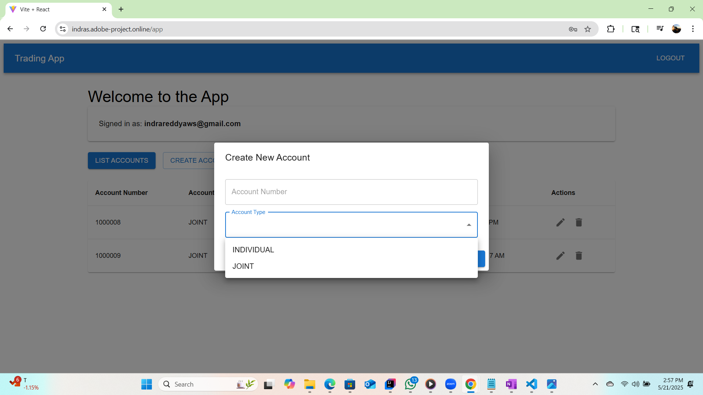

https://indras.adobe-project.online/

Edit: I have brought down the services in AWS to save cost. Attaching screenshots of the application for reference
  
  
  
  
  
  
  
  
  
  
  
  
  
  

```markdown
# 3-Tier Web Application with React, Spring Boot, and Terraform

This repository contains the code for a 3-tier web application built using:

- **Frontend**: React.js  
- **Backend**: Spring Boot  
- **Infrastructure**: Terraform (for provisioning AWS resources)

The application is deployed on AWS using services such as ECS, Application Load Balancer (ALB), API Gateway, and Cognito for authentication and authorization.

---

## Application Overview

This application follows a 3-tier architecture consisting of:

### 1. Frontend (React.js)endpoint
- Deployed on Amazon ECS within a public subnet
- Served through an Application Load Balancer (ALB)
- Accessible via: [https://indras.adobe-project.online/](https://indras.adobe-project.online/)

### 2. Backend (Spring Boot)
- Deployed on Amazon ECS within a private subnet
- Accessible only via API Gateway and ALB

### 3. Authentication
- Secured using AWS Cognito for user registration and login
- Frontend and backend communication is protected via OAuth-based JWT tokens

**Note:** API endpoints are rate-limited.

---

## Directory Structure

```

/springboot-code   → Backend code (Spring Boot)
/ui-reactjs        → Frontend code (React.js)
/terraform         → Terraform configurations for AWS infrastructure

```

---

## Authentication with AWS Cognito

Authentication is managed via AWS Cognito using OAuth and JWT-based mechanisms.

### Frontend
- Uses Cognito User Pools for user registration and authentication
- Upon successful login, obtains a JWT token to interact with secured APIs

### Backend
- Receives the JWT token from the frontend via API Gateway
- Validates the token using AWS Cognito before processing any requests

---

## Architecture Diagram

Below is an overview of the application architecture, including authentication flow with AWS Cognito:

```

+---------------------+
\|   React Frontend    | <---> Cognito User Pool <--> AWS Cognito
\|  (ECS + ALB)        |
+---------------------+
|
v
+---------------------+
\|    API Gateway      | <---> (Token Validation) --> Cognito
+---------------------+
|
v
+---------------------+
\| Spring Boot Backend | <---> Cognito Identity Pool --> Cognito
\|   (ECS + ALB)       |
+---------------------+

```

1. The user authenticates via the React frontend, which communicates with AWS Cognito.
2. After successful login, the frontend receives a JWT token.
3. The token is included in requests to the backend, routed through API Gateway.
4. The backend verifies the token before responding.

---

## Running the Application

### Prerequisites

- An active AWS account with appropriate permissions
- Terraform installed locally
- AWS CLI configured with valid credentials
- Docker installed and running

---

## Usage and Access

- Please sign up using your email ID to access and analyze the application.
- API usage is rate-limited. 

---

This project demonstrates secure cloud deployment using infrastructure as code and modern web technologies. Feedback and contributions are welcome.
``


